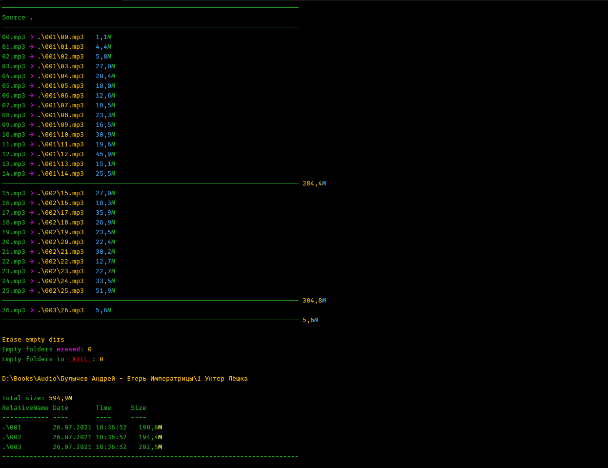

# SHOVE

CLI tool to distribute ordered files into subfolders of specified maximum size.

Tested with Posershell Core 7.0 and newer.

<figure>
    
    <figcaption>calculate manipulations</figcaption>
</figure>

<figure>
    
    <figcaption>MOVE files into subfolders</figcaption>
</figure>

# INSTALL

Run following code in your Powershell terminal:

```Posershell


```


## NAME

`shove.ps1`

## SYNOPSIS

Group files from specified folder by bunch size into subfolders


## SYNTAX

    shove [[-SrcDir] <String>] [-TargetDir <String>] [[-Mask] <String>]
    [-MaxSubFolderSize <Int32>] [-Copy] [-Numeration] [-SubfolderCounters]
    [-JustCalc] [-Help] [-Recurse] [-KillEmpty] [-WhatIf] [-Confirm]
    [<CommonParameters>]


## DESCRIPTION

New subfolders created and each subfolder will contain approx `MaxSubFolderSize` in sum.

*_NOTE_* that you must specify max size in bytes or use `Kb/Mb/GB/..` notation.

Numeration of files starts from 01. You may restart numeration in each subfolder with
use `SubfolderCounters` switch.

*_NOTE_* before you'll actually Move/Copy files try to use `WhatIf` switch to viw
how the Shove will distribute and rename your files

Also you can gather files from subfolders using `Recurse` switch even you had used
the Shove earlier


## PARAMETERS

###    -SrcDir <String>

Folder where to look for files

    Required?                    false
    Position?                    1
    Default value                $PWD
    Accept pipeline input?       false
    Accept wildcard characters?  false

###    -TargetDir <String>

Target folder where subfolders will be created

    Required?                    false
    Position?                    named
    Default value                $SrcDir  # Same as Souce Directory
    Accept pipeline input?       false
    Accept wildcard characters?  false

### -Mask <String>

Mask of files which process to

    Required?                    false
    Position?                    2
    Default value                *
    Accept pipeline input?       false
    Accept wildcard characters?  false

### -MaxSubFolderSize <Int32>

Max size of bunch, i.e. maximum size of files in each subfolder
Note: real size of bunches may overweiht this value, to preview
exact sizes use -WhatIf first

    Required?                    false
    Position?                    named
    Default value                262144000  # 250Mb
    Accept pipeline input?       false
    Accept wildcard characters?  false

### -Copy [<SwitchParameter>]

COPY files instead of MOVE

    Required?                    false
    Position?                    named
    Default value                False
    Accept pipeline input?       false
    Accept wildcard characters?  false

### -Numeration [<SwitchParameter>]

Use autonumeration for new names of files.

    Required?                    false
    Position?                    named
    Default value                False
    Accept pipeline input?       false
    Accept wildcard characters?  false

### -SubfolderCounters [<SwitchParameter>]

The Shove will restart numerations in each subfolder.

    Required?                    false
    Position?                    named
    Default value                False
    Accept pipeline input?       false
    Accept wildcard characters?  false


### -JustCalc [<SwitchParameter>]

Just calculate repositions and renames, almost like as use -WhatIf

    Required?                    false
    Position?                    named
    Default value                False  # Do the work without a peep
    Accept pipeline input?       false
    Accept wildcard characters?  false

### -Help [<SwitchParameter>]

    Required?                    false
    Position?                    named
    Default value                False
    Accept pipeline input?       false
    Accept wildcard characters?  false

### -Recurse [<SwitchParameter>]

This is It! Recursive search for the files in all subfolders of Source Directory

    Required?                    false
    Position?                    named
    Default value                False
    Accept pipeline input?       false
    Accept wildcard characters?  false

### -KillEmpty [<SwitchParameter>]

Find and Remove all Empty subfolders

    Required?                    false
    Position?                    named
    Default value                False
    Accept pipeline input?       false
    Accept wildcard characters?  false

### -WhatIf [<SwitchParameter>]

Don't actually COPY/MOVE files or other actions like *_KILL_* but get detailed
information about what will be done

    Required?                    false
    Position?                    named
    Default value
    Accept pipeline input?       false
    Accept wildcard characters?  false

### -Confirm [<SwitchParameter>]

Lets you check all action one by one

    Required?                    false
    Position?                    named
    Default value
    Accept pipeline input?       false
    Accept wildcard characters?  false

### <CommonParameters>

This cmdlet supports the common parameters: `Verbose`, `Debug`,
`ErrorAction`, `ErrorVariable`, `WarningAction`, `WarningVariable`,
`OutBuffer`, `PipelineVariable`, and `OutVariable`. For more information, see
`about_CommonParameters` (https://go.microsoft.com/fwlink/?LinkID=113216).

## EXAMPLES

#### EXAMPLE 1

```Powershell

    # Copy files by bunches about 80mb into subfolders

    shove -Max 80mb -E -D

```

#### Example 2

```Powershell

    # Show how SHOVE will MOVE files by banches about 100mb
    # -WhatIf can help to view how files will be distributed
    # by subfolders

    shove -max 97mb -NR -M -WhatIf

```

## RELATED LINKS

<https://github.com/syncap/>

